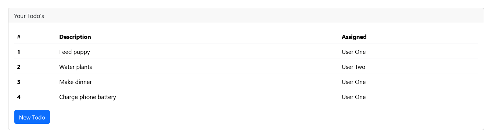
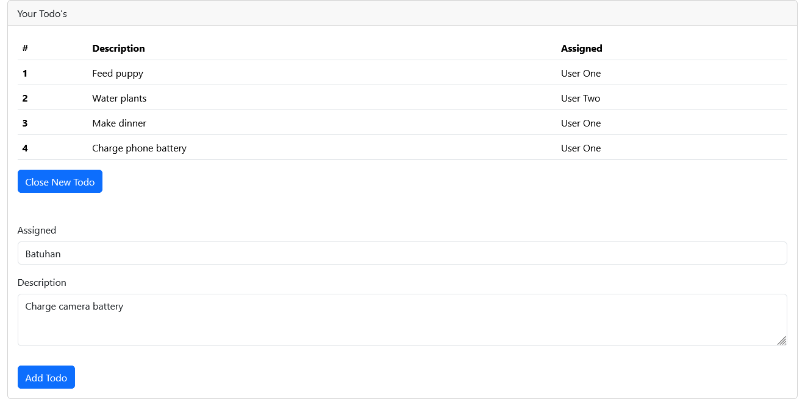
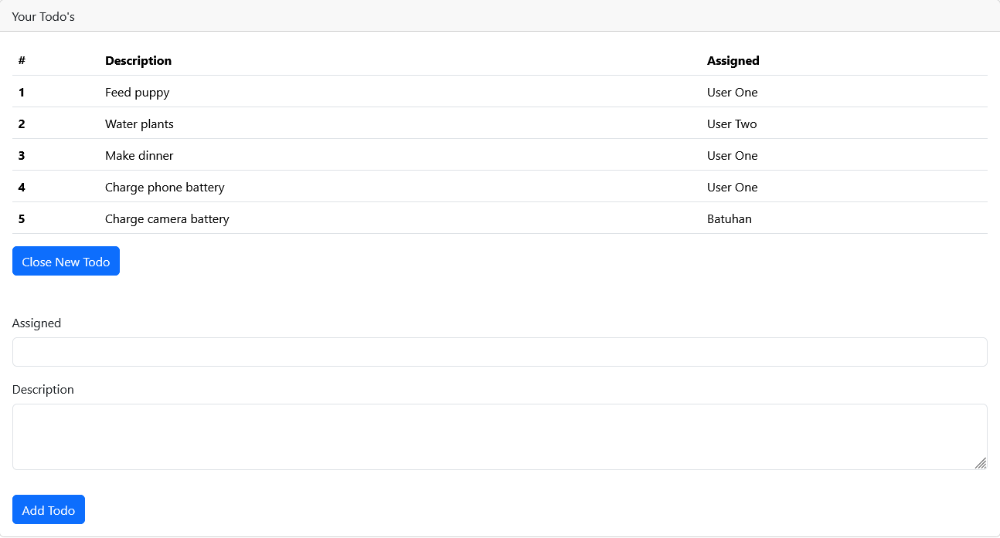
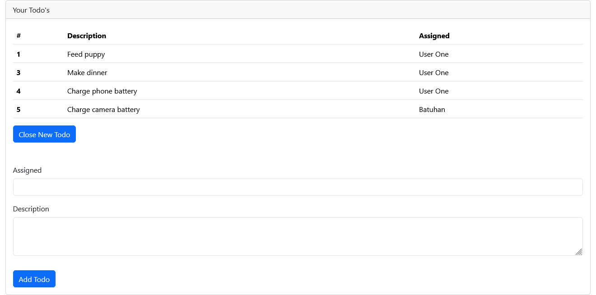

# To-Do List Project 

## Frontend Development with React.js, CSS, HTML  

---

### Proje Hakkında (Overview)  

Bu proje, günlük görevlerin yönetimini kolaylaştırmak için oluşturulmuş bir **To-Do List** uygulamasıdır. Kullanıcıların görev eklemesine, silmesine ve görevlerin atanma durumunu takip etmesine olanak sağlar.  

**Kullanılan Teknolojiler**:  
- Framework: React.js  
- Stil Tasarımı: CSS  
- Yapı ve İşlevsellik: HTML, JavaScript  

**Kullanılan Araçlar**:  
- Kod Düzenleyici: Visual Studio Code  
- Paket Yönetimi: npm  

**Temel Özellikler**:  
- Görev ekleme ve silme özellikleri.  
- Atanan kişilere göre görev takibi.  
- Görev listesinin kullanıcı dostu bir arayüzde gösterimi.  

---

### Teknik Bilgiler (Technical Details)  

**Proje Yapısı ve Kullanılan Yaklaşımlar**:  
- React bileşen tabanlı yapı kullanılarak modüler ve sürdürülebilir bir geliştirme sağlandı.  
- `useState` hook ile durum yönetimi gerçekleştirildi.  
- Fonksiyonel bileşenler ve prop geçişleriyle veri paylaşımı sağlandı.  

**Proje Yapısı**:  
- `App.js`: Uygulamanın ana dosyası, görevlerin genel yönetimini sağlar.  
- `TodoTable.js`: Tüm görevlerin tablo olarak gösterildiği bileşen.  
- `NewTodoForm.js`: Yeni görev ekleme formunu içerir.  
- `TodoRowItem.js`: Tek bir görev satırını temsil eden bileşen.  


**Kurulum (Setup)**: 
```bash
npx create-react-app todo-list
cd todo-list
npm install
```

Projeyi Çalıştırma (Run): `npm start`

---

### Kullanım (Usage)

- **Görev Ekleme**:
- "New Todo" butonuna tıklayın.
- Görevin açıklamasını ve atanacak kişiyi girin.
- "Add Todo" butonuna tıklayarak görevi ekleyin.

- **Görev Silme**:
- Görev tablosundan bir satıra tıklayarak görevi silin.

---

### Öne Çıkan Özellikler (Key Features)

- React.js ile yeniden kullanılabilir bileşenler.
- Kullanıcı dostu ve modern bir arayüz tasarımı.
- Gerçek zamanlı durum yönetimi ve veri işleme.
- Hafif ve optimize edilmiş frontend uygulaması.

---

### Demo ve Ekran Görüntüleri (Demo & Screenshots)

Proje, npm start komutuyla yerel bir sunucuda çalıştırılabilir.

- To-do List Genel Görünümü:


- To-do List Yeni görev yaratma:


- To-do List Yeni görev yarattıktan sonra:


- To-do List görev silme(görevin üstüne tıklanınca siliniyor):


---

### Katkıda Bulunanlar ve Kaynaklar (Contributors & Resources)

**Proje Sahibi**: [Batuhan Baysal](https://www.linkedin.com/in/batuhanbaysal/)

**Kaynaklar**:
- React.js Resmi Dokümantasyonu
- JavaScript ve CSS Kaynakları

---

### İletişim ve Destek (Contact & Support)

- **LinkedIn**: [Batuhan Baysal](https://www.linkedin.com/in/batuhanbaysal/)

- **GitHub**: [Batuhan Baysal](https://github.com/BatuhanBaysal)
